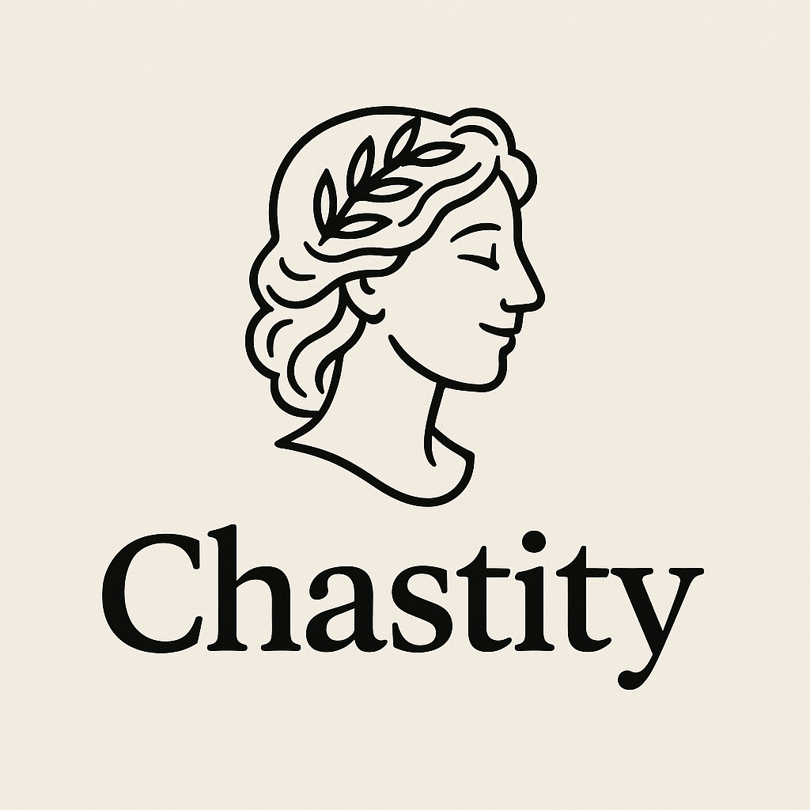

<div align="center">
  
  
  # Chastity - Virtual Museum Experience
  
  [](https://flutter.dev/)
  [](LICENSE)
  []()
</div>

## 🎭 Overview

Chastity is an elegant virtual museum application built with Flutter that leverages the Europeana APIs to bring European cultural heritage to your fingertips. Browse through thousands of artworks, discover artists, create personal collections, and enjoy a premium digital museum experience.

## ✨ Features

<div align="center">
  <table>
    <tr>
      <td align="center">🔍</td>
      <td><b>Smart Search</b> - Find artworks using keywords, artists, or periods</td>
    </tr>
    <tr>
      <td align="center">🖼️</td>
      <td><b>Rich Details</b> - Explore high-resolution images and comprehensive metadata</td>
    </tr>
    <tr>
      <td align="center">👨‍🎨</td>
      <td><b>Artist Profiles</b> - Discover information about Europe's greatest artists</td>
    </tr>
    <tr>
      <td align="center">❤️</td>
      <td><b>Favorites</b> - Save artworks to your personal favorites list</td>
    </tr>
    <tr>
      <td align="center">📚</td>
      <td><b>Collections</b> - Create themed collections of your chosen artworks</td>
    </tr>
    <tr>
      <td align="center">🔎</td>
      <td><b>Advanced Filtering</b> - Filter by year, country, or media type</td>
    </tr>
    <tr>
      <td align="center">🏛️</td>
      <td><b>Elegant Navigation</b> - Browse with intuitive grid and carousel views</td>
    </tr>
    <tr>
      <td align="center">📤</td>
      <td><b>Social Sharing</b> - Share discoveries with friends via social media</td>
    </tr>
  </table>
</div>

## 🛠️ Technical Information

<div align="center">
  
  
  
  
  
</div>

### 📦 Technologies Used

- **Flutter SDK**: Cross-platform framework for beautiful, natively compiled apps
- **HTTP Packages**: http and Dio for efficient API communication
- **JSON Serialization**: json_serializable for type-safe model conversion
- **State Management**: Provider pattern for reactive state management
- **Local Storage**: SQLite for offline data persistence
- **Europeana APIs**: Rich cultural heritage data from across Europe

### 📁 Project Structure

<div align="center">
  
</div>

```
lib/
  ├── core/                       # Core functionality and constants
  │   ├── constants.dart          # App-wide constants and API keys
  │   └── theme.dart              # Theme configuration and styles
  │
  ├── data/                       # Data layer
  │   ├── models/                 # Domain models
  │   │   ├── artwork.dart        # Artwork data model with serialization
  │   │   ├── artist.dart         # Artist data model
  │   │   └── collection.dart     # User collections model
  │   │
  │   ├── repositories/           # Repository pattern implementation
  │   │   ├── europeana_repository.dart
  │   │   └── local_repository.dart
  │   │
  │   └── services/               # External services
  │       ├── europeana_api_service.dart  # API communications
  │       └── database_service.dart       # Local storage
  │
  ├── presentation/              # UI layer
  │   ├── providers/             # State management
  │   │   ├── artwork_provider.dart
  │   │   ├── artist_provider.dart
  │   │   └── local_provider.dart
  │   │
  │   ├── screens/               # Application screens
  │   │   ├── home_screen.dart
  │   │   ├── search_screen.dart
  │   │   ├── artwork_detail_screen.dart
  │   │   ├── favorites_screen.dart
  │   │   ├── collections_screen.dart
  │   │   ├── collection_detail_screen.dart
  │   │   └── main_navigation_screen.dart
  │   │
  │   └── widgets/              # Reusable UI components
  │       ├── artwork_grid.dart
  │       ├── featured_carousel.dart
  │       └── loading_indicator.dart
  │
  └── main.dart                 # Application entry point
```

<div align="center">
  
</div>

## 📚 API Documentation

<div align="center">
  <table>
    <tr>
      <th>API</th>
      <th>Description</th>
      <th>Link</th>
    </tr>
    <tr>
      <td>Search API</td>
      <td>Search for cultural heritage items across European collections</td>
      <td><a href="https://pro.europeana.eu/page/search">Documentation</a></td>
    </tr>
    <tr>
      <td>Record API</td>
      <td>Retrieve detailed information about specific cultural heritage objects</td>
      <td><a href="https://pro.europeana.eu/page/record">Documentation</a></td>
    </tr>
    <tr>
      <td>Entity API</td>
      <td>Access information about entities like artists, places, concepts</td>
      <td><a href="https://pro.europeana.eu/page/entity-api">Documentation</a></td>
    </tr>
  </table>
</div>

## 🚀 Installation

<div align="center">
  
</div>

### Prerequisites

- Flutter SDK (3.8.1 or later)
- Dart SDK (3.0.0 or later)
- Android Studio or Visual Studio Code
- An emulator or physical device for testing

### Setup Instructions

1. **Clone the repository**

   ```bash
   git clone https://github.com/Berkawaii/chastity.git
   cd chastity
   ```

2. **Configure environment**

   Create a `.env` file in the root directory:

   ```
   API_KEY=your_europeana_api_key
   ```

3. **Install dependencies**

   ```bash
   flutter pub get
   ```

4. **Generate code for models**

   ```bash
   flutter pub run build_runner build --delete-conflicting-outputs
   ```

5. **Run the application**

   ```bash
   flutter run
   ```

<div align="center">
  
</div>

## 🗺️ Development Roadmap

<div align="center">
  <table>
    <tr>
      <th>Phase</th>
      <th>Status</th>
      <th>Description</th>
    </tr>
    <tr>
      <td>1. API Integration</td>
      <td>✅ Completed</td>
      <td>Basic Europeana API services and models</td>
    </tr>
    <tr>
      <td>2. UI Implementation</td>
      <td>✅ Completed</td>
      <td>Core screens and navigation</td>
    </tr>
    <tr>
      <td>3. Local Storage</td>
      <td>✅ Completed</td>
      <td>Favorites and collection functionality</td>
    </tr>
    <tr>
      <td>4. UI Refinement</td>
      <td>🔄 In Progress</td>
      <td>Enhanced layouts and responsive design</td>
    </tr>
    <tr>
      <td>5. Performance Optimization</td>
      <td>📅 Planned</td>
      <td>Code optimization and caching</td>
    </tr>
    <tr>
      <td>6. Advanced Features</td>
      <td>📅 Planned</td>
      <td>AR viewing, tours, and social features</td>
    </tr>
  </table>
</div>

## 💻 Development Environment

### VS Code Configurations

The project includes optimized VS Code configurations in `.vscode/launch.json`:

<div align="center">
  <table>
    <tr>
      <th>Configuration</th>
      <th>Purpose</th>
    </tr>
    <tr>
      <td>Flutter (Debug)</td>
      <td>Standard development mode with hot reload</td>
    </tr>
    <tr>
      <td>Flutter (Profile)</td>
      <td>Performance testing and optimization</td>
    </tr>
    <tr>
      <td>Flutter (Release)</td>
      <td>Testing production builds</td>
    </tr>
    <tr>
      <td>Flutter Web</td>
      <td>Run in Chrome browser (port 8000)</td>
    </tr>
    <tr>
      <td>All Tests</td>
      <td>Run the complete test suite</td>
    </tr>
  </table>
</div>

## 📱 Screenshots

<div align="center">
  <p>Coming soon!</p>
</div>

## 🤝 Contributing

Contributions are welcome! Please feel free to submit a Pull Request.

## 📄 License

This project is licensed under the MIT License - see the [LICENSE](LICENSE) file for details.

```
MIT License

Copyright (c) 2025 Berkawaii

Permission is hereby granted, free of charge, to any person obtaining a copy
of this software and associated documentation files (the "Software"), to deal
in the Software without restriction, including without limitation the rights
to use, copy, modify, merge, publish, distribute, sublicense, and/or sell
copies of the Software...
```

## 👏 Acknowledgements

- [Europeana](https://www.europeana.eu/) for their comprehensive cultural heritage APIs
- The Flutter team for their excellent framework and documentation
- All the artists whose works are showcased in this virtual museum

<div align="center">
  
  <p>Chastity - Bringing Europe's Cultural Heritage to Your Fingertips</p>
  <p>© 2025 Berkawaii</p>
</div>
